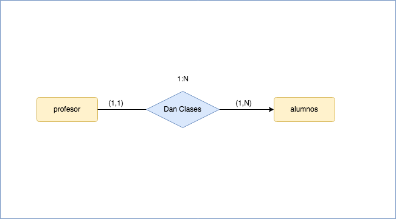

# Ejercicio Básicos de E/R

##  [Ejercicio 1]

En una academia los profesores dan clase a los alumnos matriculados de modo que todo profesor da clase a al menos un alumno y todo alumno recibe clases de un único profesor . 

### [solución]

##  [Ejercicio 2]

Los profesores de un centro pueden ser o no tutores de un alumno, en cualquier caso los alumnos  solo podrán tener un único tutor   

### [solución]

##  [Ejercicio 3]

En un comercio ,un cliente compra varios productos,y un producto puede ser comprado por varios clientes.

### [solución]

##  [Ejercicio 4]

Representa la relación entre Persona y sus padres. 

### [solución]

##  [Ejercicio 5]

En una carrera de relevos,representar la relación dar relevo a otros atletas(para calcular las cardinbalidades máximas y mínimas deberás tener en cuenta si se trata de el primero,el último o el 2º o 3º)

### [solución]

##  [Ejercicio 6]

Una empresa esta compuersta por varios departamentos de los que se desea almacenar  su nº,nombre y localidad.-Los empleados deben estar asignados aun departamento y se guardarán sus datos nº empleado,apellido,salario.Además,cada empleado tiene un jefe.(Nota.se ha supuesto que un departamento puede no tener empleados) 

### [solución]

##  [Ejercicio 7]

Se desea construir un bd para mantener información sobre los equipos y partidos de la liga.-Un equipo tiene un cierto nº de jugadores(Id_jugador,datos personales)y no todos participan en un partido.Queremos registrar además por cada partido ,qué jugadores juegan,la fecha y hora del partido,resultados de los encuentros y las posiciones donde juegan. 

### [solución]

##  [Ejercicio 8]

En una empresa, para cada uno de sus empleados,se guardan los datos de sus hijos.Representa esta relación haciendo las suposiciones que creas convenientes

### [solución]

##  [Ejercicio 9]

Se desea diseñar una BD para una Unioversidad que contega información sobre carreras y asignaturas que se pueden estudiar:Además se incluirá la información de los alumnos matriculados en las correspondientes asignaturas y las calificaciones que obtienen en las asignaturas en las que estan matriculados .Nota:suponer que una asignatura solo puede pertenecer a una carrera

### [solución]

