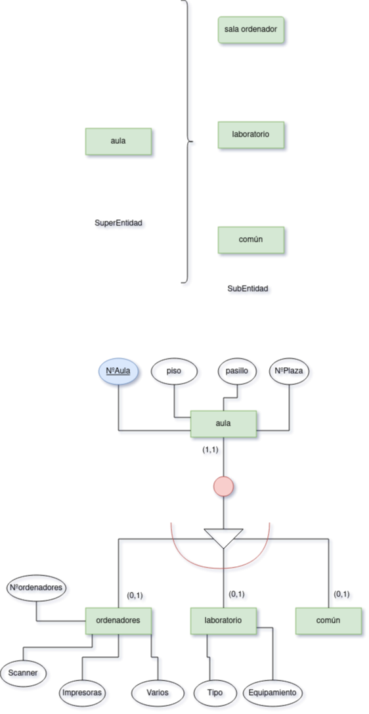

# [Ejercicio 8]

 Queremos recoger la información correspondiente a las aulas de un instituto de secundaria con la especialidad de informática:

    De cada aula se quiere recoger la siguiente información: NºAula, Piso, Pasillo, Nº plazas. El número de aula es único y distinto para todas ellas.
    Cuando las aulas son salas de ordenadores necesitamos saber: nº de ordenadores, escáner y nº de impresoras, así como otros equipamientos que pudieran instalarse.
    Si se trata de laboratorios queremos saber el tipo (de ciencias, de idioma, etc.) y el equipamiento que tiene.
    Todas las aulas, sean comunes, laboratorios o salas de ordenadores, pueden tener o no proyector y pizarra interactiva.
    Existen otros tipos de aulas no recogidos en el modelo anterior como gimnasio, biblioteca, etc.
    Cada aula se utiliza únicamente para las funciones que tiene asignadas (no se imparte una clase normal en un laboratorio, etc.)

### [solución]

